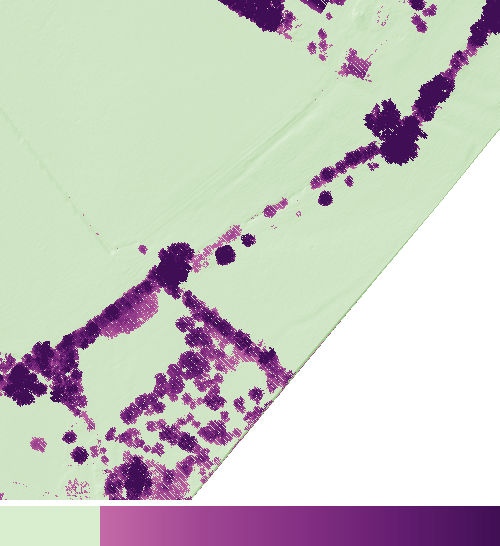

# GrounDiff for EA LiDAR DTM production

Learns what editors change after `lasground_new`, and turns that into a
predicted DTM, a per-pixel **edit probability** and ready-to-view overlays for
LP360 and QGIS.

* **GrounDiff** — Dhaouadi, Meier, Kaiser & Cremers, *GrounDiff: Diffusion-Based
  Ground Surface Generation from Digital Surface Models*, WACV 2026
  ([arXiv 2511.10391](https://arxiv.org/abs/2511.10391)). No official code exists;
  the first author advised building on
  [Palette](https://github.com/janspiry/palette-image-to-image-diffusion-models).
  The denoiser here is Palette's U-Net, ported and checked output-for-output
  against Palette (62.64M parameters = the 62.6M in GrounDiff §8.1).
* **ResDepth** — Stucker & Schindler, ISPRS J. 2022
  ([code](https://github.com/prs-eth/ResDepth), MIT): deterministic
  before → after baseline, vendored unchanged.
* **ALS2DTM / DeepTerRa** — Lê et al., JSTARS 2022: source of the extra input
  rasters (lowest return, density / height-spread / echo rasters, and the
  2-channel ground/non-ground raster, here built from `lasground_new` classes).

Everything runs on CUDA, Apple Silicon (MPS) or CPU; inference also runs
without PyTorch through ONNX Runtime (QGIS plugin).



*Overlay colours on a real EA tile (TL4378nw) shaded light green. The values
here are a stand-in (canopy height), only to show the colours: transparent
below 0.2, then magenta → deep purple, darker and more opaque as the value
rises.*

---

## How the before → after model works

Inputs per cell: highest / lowest / lowest-last return, point density, height
spread, echoes, the `lasground_new` DTM (TIN of its ground points) and its
ground / non-ground raster. Target: the EA hand-edited DTM (TIN of the final
ground + water classes of the same points).

GrounDiff's gate (Eq. 5) is anchored on the **`lasground_new` DTM**:

    DTM = σ(ℓ) · DTM_lasground + (1 − σ(ℓ)) · (DTM_lasground − r̂)

so the model keeps the automated surface where it is right and corrects it
where editors would. Its confidence head (Eq. 14, M_α = |DTM_lasground − DTM_EA| < α)
therefore learns "no edit needed": **p_edit = 1 − σ(ℓ)** is the per-pixel
probability that an editor changes the ground there, trained with the paper's
own loss. `dz_before = DTM_pred − DTM_lasground` is the size of the predicted
correction.

## Install

```bash
# Mac (Apple Silicon) or Linux/Windows with CUDA
python -m venv .venv && source .venv/bin/activate
pip install torch                      # CUDA: pick the wheel for your CUDA version at pytorch.org
pip install -e ".[onnx,dev]"
pytest                                 # ~70 tests, ~1 min on CPU
```

## Workflow

### 1. Get tiles

```bash
# EA/DEFRA 2022 COPC tiles (500 m, classified) from the open-data bucket, balanced across England
python -m groundiff.data.download --out data/laz/after --target 1000 --min-per-grid 20 --blocks 3
```

`--blocks 3` also fetches each tile's 8 neighbours (context for buffers and
spatial splits). These files carry **no CRS**; outputs default to EPSG:27700.

### 2. Recreate the automated classification ("before")

Production uses `lasground_new` with **default settings**. This writes the exact
command (paired by file name) for a machine with licensed LAStools:

```bash
python -m groundiff.data.lasground --in data/laz/after --out data/laz/before --cores 8 --verbose --windows
# run run_lasground_new.bat, then:
python -m groundiff.data.lasground check --before data/laz/before --after data/laz/after
```

Keep the `-v` log: the lasground_new README gives two different default steps
(25 m in the text, 5.0 in the argument list), and the log shows what your
binary used. Unlicensed LAStools distorts files above ~1.5M points.

### 3. Check files from different producers

```bash
python -m groundiff.data.lasinspect ea_tile.laz --compare lp360_tile.las
```

Reports version, point format, WKT bit, CRS storage, extra bytes, flags
(overlap / synthetic / withheld / key-point), classes and return statistics,
with warnings for things that make PDAL / QGIS reject files. The reader
tolerates all of them; `--drop-overlap` / `--drop-synthetic` are available
everywhere.

### 4. Rasterise and split

```bash
python -m groundiff.data.preprocess --after-dir data/laz/after --before-dir data/laz/before \
    --out data/scenes_05m --gsd 0.5 --workers 6
python -m groundiff.data.split --root data/scenes_05m --out data/split.json --block-km 10
```

Noise classes 7 and 18 are removed. Splits are by 10 km blocks so neighbouring
tiles never straddle train and test.

### 5. Train

| Config | What |
|---|---|
| `configs/before_after.json` | GrounDiff, before → after (recommended) |
| `configs/paper_dsm2dtm.json` | GrounDiff as published (DSM → DTM) |
| `configs/resdepth_before_after.json` | ResDepth baseline |

```bash
# MacBook Pro M3 Max, 36 GB: effective batch 16 as in the paper
python -m groundiff.train configs/before_after.json --set train.batch_size=4 train.grad_accum=4 train.num_workers=6
# 16 GB CUDA GPU: bf16 is automatic
python -m groundiff.train configs/before_after.json --set train.batch_size=8 train.grad_accum=2
# tight memory: add model.use_checkpoint=true (≈25 % slower, several-fold less activation memory)
# fine-tune an existing checkpoint (new input channels start at zero, so it starts exactly where it was)
python -m groundiff.train configs/before_after.json --init-from runs/paper_dsm2dtm/best.pt
```

Runs resume from `last.pt`. Validation reports the paper's metrics for both the
model and `lasground_new` against the EA DTM. Because the U-Net uses GroupNorm,
batch 4 × 4 accumulation gives the same gradient as batch 16.

Rough cost (estimates, not measurements): ≈1 TFLOP per 256² tile per training
step, so the paper's 10–20k iterations at batch 16 is roughly half a day to a
day on an M3 Max (30-core GPU) and a few hours on a recent 16 GB NVIDIA card.
Memory at 256² tiles: batch 4 fp32 ≈ 10–13 GB, batch 8 bf16 ≈ 10 GB, batch 16
fp32 ≈ 35–46 GB. Inference needs ≈0.5 GB.

### 6. Evaluate on held-out scenes

```bash
python -m groundiff.infer --checkpoint runs/before_after/best.pt --scenes data/scenes_05m \
    --split-file data/split.json --split test --out results/test --samples 4
```

Per scene: GeoTIFFs, overlays, `metrics.json` (model and `lasground_new` vs the
EA DTM: RMSE, MAE, Type I/II/total, MedAE, NMAD, roughness) and `priority.csv`
(100 m blocks ranked by predicted edit). With a reference, `capture_topK`
reports how much of the true edit volume the top 5/10/20 % of blocks contain;
this ranking measure is ours, neither paper defines one.

### 7. Export and run anywhere

```bash
python -m groundiff.export runs/before_after/best.pt --out models/before_after   # .onnx + .json, checked vs PyTorch
python -m groundiff.batch --onnx models/before_after.onnx \
    --after tiles/*.laz --before tiles_lasground/*.laz --out results/area1 --workers 3
```

`batch` takes any number of tiles, reads each with a 64 m buffer of neighbour
points (so there are no seams), prepares tiles in parallel while the network
runs, and writes mosaics: `dtm.tif`, `p_edit.tif`, `dz_before.tif`
(`std.tif` with `--samples > 1` or `--tta`), their overlays, and per-tile pieces
in `tiles/`. Tested on real EA tiles: the mosaic matches a single
rasterisation of the merged points to 5e-7 m.

## Using the outputs in LP360

For each map there are two pre-coloured GeoTIFFs:

* `*_overlay.tif` — RGBA with an alpha channel: transparent where nothing
  needs attention. Add it as a raster layer above the DTM.
* `*_overlay_rgb.tif` — RGB with no-data = 0, for viewers that ignore alpha;
  transparent pixels are no-data, set the layer's transparency in the viewer.

Both have `.tfw` and `.prj` side-cars. The colour ramp (one hue, the complement
of the light-green DTM shading) was checked numerically after blending over
pale, mid and hill-shade greens, white and grey: lightness decreases
monotonically, steps stay distinguishable, and even the palest visible step has
≥ 2.3 : 1 contrast with the background. The float rasters (`p_edit.tif`, …)
get a QGIS `.qml` style next to them, applied automatically when opened in QGIS.

| Overlay | Shows | Transparent below |
|---|---|---|
| `p_edit` | probability that editors change the ground | 0.2 |
| `dz_before` | size of the predicted correction | 0.15 m |
| `std` | spread across samples / flips | 0.1 m |

## QGIS plugin

```bash
python tools/build_qgis_plugin.py        # -> dist/groundiff_qgis.zip
```

Install with *Plugins → Manage and Install Plugins → Install from ZIP*. Add
the runtime to QGIS's Python (OSGeo4W Shell on Windows):
`python -m pip install onnxruntime-directml laspy[lazrs]` (any Windows GPU),
or `onnxruntime-gpu` (NVIDIA), or `onnxruntime` (CPU; on macOS CoreML is used
automatically).

Processing Toolbox → GrounDiff:

* **Predict DTM from point-cloud tiles**: select any number of LAS/LAZ files
  (… → Add File(s)), optionally the `lasground_new` versions, an output folder,
  and how many tiles to prepare in parallel. Adds the DTM and edit overlay to
  the map when done.
* **Predict DTM from rasters**: rasters already on one grid.
* **Inspect LAS/LAZ file**: the inspector above, optionally comparing two files.

The plugin reads point clouds itself (laspy), so files that QGIS's own
point-cloud layers (PDAL) refuse can still be processed.

## Faithfulness to the papers

| Item | Here | Paper |
|---|---|---|
| Denoiser | Palette U-Net, 62.64M | U-Net "inspired by DDPM", 62.6M |
| Gating, loss (Eq. 5, 11–14), λ | as published | |
| T, schedule | T = 10, Palette cosine | "cosine … from 0.0001 to 0.02" (ambiguous; `cosine_range` implements the other reading) |
| Sampler init | N(s, I) default; noise, DSM, prior as options | §3.2, Table 6 |
| PrioStitch | global coarse prior, 50 % overlap, min/linear/mean blending | §3.3, Table 7 |
| Augmentation | rotations + ±5° jitter, zoom {256, 512, 1024} + crop, flips, p = 0.5 each | §7.1 |
| Normalisation | per-tile min–max to [−1, 1] from inputs only, 2 m minimum range | min–max over DSM **and GT** (GT unknown at inference) |
| Optimiser | AdamW 1e-4, wd 0.01, 500 warm-up, cosine, batch 16 | §7.3 |
| α for M_α | 0.2 m (option: class of highest return) | not given |
| EMA | 0.999 with warm-up | not stated (Palette uses one) |
| Before → after | gate on `lasground_new` DTM, extra inputs from ALS2DTM | extension |

Known gap: with Palette's cosine schedule the last step is almost pure noise
(√ᾱ_T = 0.005), so a prior injected at t = T barely reaches the network. The
paper reports a large PrioStitch gain (Table 7), which suggests their setup
kept more of it. Worth ablating: `diffusion.schedule=cosine_range`, or
`--t-start 5` at inference. In before → after mode the `lasground_new` DTM is
also an input channel, so the model sees it at every step regardless.

## Suggested ablations

* schedule `cosine` vs `cosine_range`; `--t-start` for the prior
* `data.m_alpha_mode=top_class` (avoids labelling steep ground as non-ground)
* `loss.units=metres` (stops flat tiles dominating)
* gate on `dsm_min` in DSM → DTM mode (on a real EA tile, 94 % of cells have
  the lowest return within 0.2 m of the final DTM vs 81 % for the highest)
* ResDepth vs GrounDiff on the same split

## Not done yet

* Breaklines: the pipeline has no breakline output yet. Raster breakline
  targets need a sample of how they are stored in production.
* Point reclassification from the predicted DTM (a height-above-DTM rule, or
  a dense classification head as the GrounDiff author suggested) is not
  included.

## Tests

`pytest` covers: the U-Net matching Palette, schedules and posterior maths,
every sampler init, loss and metric definitions, rasterisation, TIN, dataset
and augmentation consistency, spatial splits, training / resume / fine-tune
widening, numpy vs PyTorch sampler equivalence, ONNX export, scene inference
in every mode, seamless batch mosaics, overlays, LAS variants (LAS 1.2/1.4,
missing WKT bit, extra bytes, broken return numbers, flags) and the QGIS
plugin's logic.
